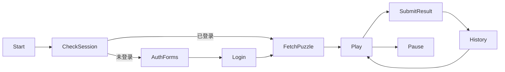

# Architecture & API

> Last updated: 2025-11-26T14:10:00Z

本文是数独 Web 项目的唯一事实来源，描述系统设计、数据模型与接口契约。如代码与本文不符，以本文为准。

## 1. 模块拓扑
| 层级 | 模块 | 职责 |
| --- | --- | --- |
| Presentation | `web/src` | React + TypeScript，处理视图、输入、状态与 API 调用（含排行榜渲染）。 |
| Application | `server/src/routes/*` | Express API，封装用例（注册、登录、取题、记录战绩）。 |
| Domain | `server/src/sudoku/*` | 数独生成器、校验器、难度策略。 |
| Infrastructure | `server/src/db.ts`, `middleware/*` | SQLite 访问、鉴权、配置。 |

## 2. 数据模型
### SQLite
```sql
CREATE TABLE users (
  id INTEGER PRIMARY KEY AUTOINCREMENT,
  email TEXT UNIQUE NOT NULL,
  display_name TEXT NOT NULL,
  password_hash TEXT NOT NULL,
  created_at TEXT NOT NULL DEFAULT (datetime('now'))
);

CREATE TABLE game_history (
  id INTEGER PRIMARY KEY AUTOINCREMENT,
  user_id INTEGER NOT NULL REFERENCES users(id),
  difficulty TEXT NOT NULL,           -- easy | medium | hard
  duration_seconds INTEGER NOT NULL,
  mistakes INTEGER NOT NULL,
  completed_at TEXT NOT NULL,
  puzzle_seed TEXT NOT NULL,          -- 81-char string (0 表示留空)
  solution_seed TEXT NOT NULL,        -- 81-char string（对应解）
  board_snapshot TEXT NOT NULL        -- JSON of final board
);
```

### TypeScript 接口
```ts
type Difficulty = 'easy' | 'medium' | 'hard';

interface AuthUser {
  id: number;
  email: string;
  displayName: string;
  createdAt: string;
}

interface GameHistoryItem {
  id: number;
  difficulty: Difficulty;
  durationSeconds: number;
  mistakes: number;
  completedAt: string;
  puzzleSeed: string;
}
```

## 3. API 契约
所有请求/响应体均为 JSON，除登录/注册需要 `credentials: include` 以写入 HttpOnly Cookie。

| Method | Path | 描述 |
| --- | --- | --- |
| POST | `/api/auth/register` | body: `{ email, password, displayName }` → 201。 |
| POST | `/api/auth/login` | body: `{ email, password }` → 200 + 设置 `auth_token` Cookie。 |
| POST | `/api/auth/logout` | 清除 Cookie。 |
| GET | `/api/auth/me` | 返回当前用户信息。 |
| GET | `/api/puzzle/new?difficulty=medium` | 返回 `{ puzzle: number[][], solution: number[][], seed }`。 |
| GET | `/api/games/history` | 需鉴权；返回历史列表。 |
| POST | `/api/games/history` | 需鉴权；body: `{ difficulty, durationSeconds, mistakes, puzzleSeed, solutionSeed, boardSnapshot }`。 |

错误统一返回：
```json
{ "error": { "code": "VALIDATION_ERROR", "message": "xxx" } }
```

## 4. 鉴权流程
1. 注册/登录成功 → 生成 JWT（`sub=user.id`, 过期 7 天）。
2. 写入 HttpOnly Cookie `auth_token`，`SameSite=Strict`，`Secure` 由 `NODE_ENV` 控制。
3. 受保护路由通过中间件读取 Cookie，验证 JWT。
4. 将 `req.user` 注入下游 handler。

## 5. 数独生成策略
1. 生成完整合法棋盘（回溯法）。
2. 根据难度控制挖空数量与对称性：
   - easy: 36~40 givens
   - medium: 32~35
   - hard: 28~31
3. 每次挖空后运行唯一解校验（回溯统计解数，>1 则回滚）。
4. 产出：
   - `puzzle`：二维数组（0 为待填）
   - `solution`：对应完整解
   - `seed`：81 长度字符串，便于存档/复盘

## 6. 前端状态流


UI 主体：
- `App`：根据登录状态在 `AuthPanel` 与「数独的孤独世界（快来play我）」主题面板之间切换，协调计时、难度选择、草稿模式、失误上限、排行榜与战绩刷新；负责胜利/失败反馈 Overlay。
- `SudokuBoard`：渲染 9x9 棋盘，支持键盘 / 数字键盘输入、同行同列高亮、同值联动、候选数字（Pencil）及冲突提示，并以粗线区分九宫格边界。
- `HistoryPanel`：展示历史战绩列表。

交互约束：
- 选中格会同步高亮同行、同列、同宫，已填写的相同数字也会聚焦，便于排查，九宫格边界使用粗线突出。
- 数字键盘会显示当前已填数量 / 剩余数量，帮助决策；在草稿模式下允许超额标记。
- 草稿模式（按钮或 `Shift`/`N` 快捷键）用于录入候选数字，单格展示 3x3 Notes，不影响最终答案。
- 输入重复数字会覆盖旧值并清空该格草稿；按 `Backspace/Delete/0` 归零。
- 不同难度有独立失误上限（新手 8、进阶 5、专家 3）；超过阈值会触发鼓励 Overlay 并暂停本局。
- 通关会触发胜利特效（王子抱公主）并展示用时等信息，可直接再战或跳转至排行榜。
- 排行榜按难度维度展示 Top10（按用时升序、错误少优先），游客可浏览，登录玩家可冲榜。

关键 Hook：
- `useAuth()`：缓存 `/api/auth/me`、提供登录/注册/登出并暴露加载态与错误。
- `useTimer()`：开始/暂停/重置计时，并通过 `seconds` 与 `running` 状态驱动 UI。

## 7. 非功能需求
- **性能**：生成一局 < 100ms；API 响应 < 200ms。
- **安全**：密码哈希、JWT 签名、输入校验。
- **可维护性**：模块化目录 + TypeScript 类型定义。

## 8. 变更日志
- 2025-11-26T00:00:00Z：定义初始架构与 API。
- 2025-11-26T12:00:00Z：落地 Express + SQLite 后端与 React 前端，实现注册/登录、取题、游玩、战绩记录闭环。
- 2025-11-26T13:00:00Z：完善前端交互（同行列高亮、同值联动、草稿模式、数字余量提示）。
- 2025-11-26T13:40:00Z：加入难度差异提示、失误上限、九宫格粗线、胜负情绪反馈及品牌更新。
- 2025-11-26T14:10:00Z：新增排行榜模块（API + UI），支持按难度展示 Top10。

本文件需与实现保持同步，任何代码改动必须先更新相应章节。

